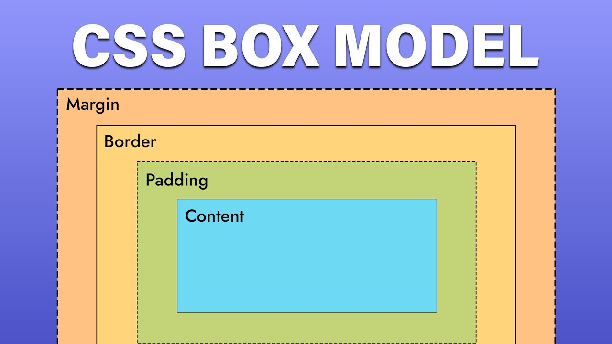

## Desarrollo en plataformas clase 3
- El lenguaje CSS3 es el estándar definido para definir(desarrollar) la presentación visual de los documentos HTML
- Hay tres formas de trabajar con CSS
    - Crear un archivo `.css`
    - Podemos poder las reglas en el head de la página web
    - Podemos definir el estilo en las etiquetas de nuestro HTML
- Un archivo `.css` para referenciarlo en nuestro HTML debemos poder un `href`
- El diseño adaptable es aquel diseño que es capaz de adaptarse a diferentes dispositivos sin perder la funcionalidad
- CSS3 permite evolucionar cada módulo por separado.
    - Podemos utilzar import junto a diferentes librerías(módulos) que ya vienen incorporados
- Es modular y viene dividido en diferentes especificaciones
    - La tipografía nos permite utilizar fuentes personalizadas `@font-face`
    - Flexbox(Lineal/adaptar los elementos dentro de un contendor) y Grid(Matrices/adaptar toda la página) para layouts complejos
    - RGBA, HSLA, gradientes lineales y radiales
    - Nativas con transition `@keyframes` (Contiene ciertas animaciones nativas)
## Principios del diseño adaptable
- El contenido HTML se debe adaptar al tamaño de una pantalla
- `Movile First` -> El primer diseño que yo haga debe ser para los celulares
    - Através de `Media Queries` podemos aumentar la anchura para pantallas más grandes
        - Media Queries es capaz de identificar al resolución de la pantalla del usuario, lo que nos permite adaptar por ejemplo las imagenes en función de la resolución del monitor del usuario
    - Layout fluido con flexbox y grid
        - Trabajan de forma conjunta
    - **RESULTADO:** Diseño adaptable en diferentes dispositivos
- Fluidez: Se emplean unidades relativas(%, em, rem, vw, vh) en lugar de pixeles fijos
- Imágenes y videos flexibles: max-width: **100% garantiza que no desborden**(depende de la pantalla del dispositivo, es decir se adapta)
- Jerarquía tipográfica adaptable: escalas fluidas,por ejemplo h1{font-size: clamp(1.5 rem, 2vw, 2.5rem);} - el tamaño es 1.5rem, el máximo 2.5rem y entre esos límites se ajusta el ancho de la ventana

## Diferencia entre diseño adaptable y diseño responsivo
- Suelen usarse como sinónimos pero no son iguales
- Diseño responsivo (responsive): utiliza un único diseño flexible. Sus elementos se reorganizan y cambian de tamaño continuamente según el ancho de la pantalla, normalmente mediante CSS, Flexbox, Grid y media queries.
- Diseño adaptable (adaptive): utiliza varios diseños predefinidos para tamaños específicos, por ejemplo uno para móvil, otro para tablet y otro para escritorio. El sistema selecciona el diseño correspondiente según el dispositivo o resolución.

## Errores comúnes
- Medidas rígidas: usar width: 960px; en vez de max-width
- Olvidar probar en distintos dispositivos
- No usar medias queries: Confiar en que el navegador lo ajustará solo
- Abusar de pixeles: dificulta la escalabilidad
- Ignorar la accesibilidad
- Las líneas del HTML sean muy largas(más de 80 palabras).

## Flexbox y Grid
- El modelo de caja(`BoxModel`):
    - Cada etiqueta en una página web se interpreta como una caja independiente
    - Cada etiqueta tiene su propio contenido, relleno, bordes y márgenes
    - Permite que se adapte fácil
- `Flexbox y Grid` reemplazan técnicas antiguas como los float o el uso excesivo de tablas.

## El modelo de caja
- Cada elemento de una página web esta envuelto en una caja
    - **content**: el texto imagen o elemento principal
    - **padding**: el espacio interno entre el contenido y el borde
    - **border**: la línea que rodea el contenido y el padding
    - **margin**: el espacio que separa un elemento de los demás elementos(separa una caja de las demás)

- Flexbox diseño unidireccional
- Grid layout diseño matricial(bidireccional)

## Buenas prácticas
- Usar flexbox para alineación local(por ejemplo elementos dentro de un header)

## Concepto media queries y diseño responsivo
- El diseño responsivo es la adaptación fluida y progresiva de una interfaz web a distintos tamaños y características de dispositivos.
- Su herramienta principal en CSS3 son las medias queries
- **Media queries:** Son reglas de CSS que permiten aplicar estilos dependiendo de las características del dispositivo o de la ventana, principalmente su ancho

## Propiedades comunes en media queries

| Propiedad | Descripción | Ejemplo |
|---|---|---|
| `width` | Ancho exacto de la ventana | `@media (width: 768px)` |
| `min-width` | Ancho mínimo de la ventana | `@media (min-width: 768px)` |
| `max-width` | Ancho máximo de la ventana | `@media (max-width: 767px)` |
| `height` | Alto exacto de la ventana | `@media (height: 600px)` |
| `min-height` | Alto mínimo de la ventana | `@media (min-height: 600px)` |
| `max-height` | Alto máximo de la ventana | `@media (max-height: 800px)` |
| `orientation` | Orientación de la pantalla | `@media (orientation: landscape)` |
| `resolution` | Resolución del dispositivo | `@media (min-resolution: 2dppx)` |
| `prefers-color-scheme` | Preferencia de tema claro u oscuro | `@media (prefers-color-scheme: dark)` |
| `prefers-reduced-motion` | Preferencia por reducir animaciones | `@media (prefers-reduced-motion: reduce)` |
| `hover` | Indica si el dispositivo permite pasar el cursor | `@media (hover: hover)` |
| `pointer` | Precisión del dispositivo apuntador | `@media (pointer: coarse)` |
## Breakpoints sugeridos

| Dispositivo | Ancho recomendado | Media query recomendada |
|---|---|---|
| Móvil pequeño | `0-480px` | `@media (max-width: 480px)` |
| Móvil grande | `481px` a `767px` | `@media (min-width: 480px) and (max-width: 767px)` |
| Tablet | `768px` a `1023px` | `@media (min-width: 768px) and (max-width: 1023px)` |
| Laptop | `1024px` a `1199px` | `@media (min-width: 1024px) and (max-width: 1199px)` |
| Desktop | Desde `1200px+` | `@media (min-width: 1200px)` |

- Media queries avanzados(no contienen pixeles)
## Buenas prácticas diseño responsivo
- NO uses demasiados breakpoints: elige los necesarios
- USa unidades relativas
- Diseña primero para dispositivos móviles y luego adapta el diseño a pantallas más grandes
- Usa `max-width: 100%` en imágenes y videos para evitar que se desborden
- Utiliza `Flexbox` y `Grid` para organizar los elementos de la página
- Evita medidas rígidas como `width: 960px`; prefiere `max-width`, porcentajes y unidades relativas
- Usa `clamp()` para crear tamaños de texto que se adapten de forma fluida
- Prueba la página en diferentes tamaños de pantalla y orientaciones
- Verifica que los textos sean legibles y que los botones sean fáciles de utilizar
- Mantén una navegación accesible, incluso en pantallas pequeñas

## Frameworks
- Un framework de CSS es una colección de estilos, componentes y utilidades reutilizables que facilita la creación de interfaces web.
- **Bootstrap:** framework que contiene componentes y clases predefinidas listas para usar, como botones, tarjetas, formularios, menús y sistemas de columnas.
    - Permite crear diseños responsivos mediante un sistema de grid y breakpoints establecidos.
- **Tailwind CSS:** framework basado en clases de utilidad pequeñas que se combinan directamente en el HTML para construir el diseño.
    - Permite personalizar los estilos sin escribir muchas reglas CSS propias.
- **Diferencia principal:** Bootstrap ofrece componentes visuales ya diseñados; Tailwind ofrece utilidades para crear diseños más personalizados.
- **Ventaja:** aceleran el desarrollo y ayudan a mantener una estructura visual consistente.