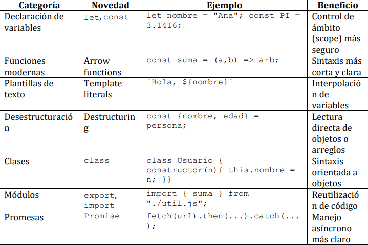
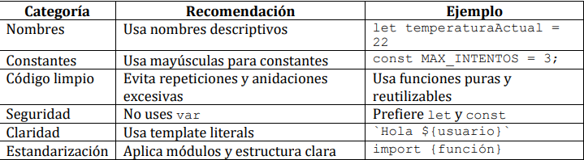
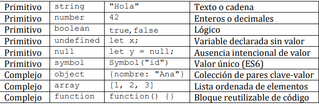
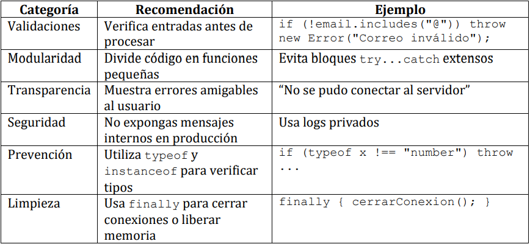

- Asincrónica: Todos los usuarios le mandaron una petición al servidor
    - Les peticiones al llegar al servidor se hace una cola y va resolviendo una a una.
    - Se resuelve con teoría de colas.
- Javascript le da la interactividad a la página web
- `Sanitización: `Revisar el texto del input antes de ser enviado al servidor.
- Hay que manejar bien los eventos
    - Load, doble click, etc.
- Manipula el contenido(DOM(Document Object Model))
    - Permite controlar el contenido y sus elementos
- Permite comunicarnos con servidores
    - `apifetch` -> Nos permite contactarnos entre apis
## Evolución de javascript

- En javascript no necesitamos declarar el tipo de variable, solo declaramos con `let numero = 5` o `let texto = "Hola Mundo"`
- Utiliza `tipado dinámico: `una variable se asigna y se comprueba en tiempo de ejecución, basándose en el valor que tiene en ese momento 
## Variables y ámbito
```javascript
// var: alcance global o de función
var x = 10;
if (true) {
 var x = 20;
}
console.log(x); // 20 → sobrescribe la variable global
// let: alcance de bloque
let y = 10;
if (true) {
 let y = 20;
 console.log(y); // 20 → variable local al bloque
}
console.log(y); // 10 → variable original se mantiene
// const: valor inmutable
const PI = 3.1416;
```
- Usa let para variables que cambian.
- Usa const para valores fijos.
- Evita var salvo en casos legacy
---
## Funciones modernas y arrow functions
- Permiten escribir funciones más concisas y legibles:
```javascript
// Función tradicional
function saludar(nombre) {
 return "Hola " + nombre;
}
// Arrow function
const saludar = nombre => `Hola ${nombre}`;
```
- Otro ejemplo:
```javascript
class Boton {
 constructor() {
 this.mensaje = "Click detectado";
 }

 activar() {
 document.querySelector("button")
 .addEventListener("click", () => {
 console.log(this.mensaje);
 });
 }
}
```
## Desestructuración
- `Desestructuración`: Permite extraer valores de objetos o arreglos fácilmente
```javascript
const persona = { nombre: "Ana", edad: 28 };
const { nombre, edad } = persona;
console.log(nombre, edad); // Ana 28

function mostrar({ nombre, edad }) {
 console.log(`${nombre} tiene ${edad} años`);
} // se puede ocupar desestructuración para combinar con funciones
```

## Buenas prácticas

## Tipos de datos javascript(Primitivos o complejos)


## Funciones
- Es la base de la modularidad
- Función clásica: Cuando necesito hacer referencia al `this`
- Para el resto de casos podemos utilizar funciones tipo fecha
- Retornos anticipados en vez de anidar
    - Anidar tenemos que evaluar....
    - Los retornos anticipados son más rápidos
## Promesas, ASYNC/AWAIT
- `Paginación: `Oculta al usuario los procesos detrás, siempre se debe utilizar cuando ocupamos métodos asincrónicos.
- Utiliza un modelo single-threaded, solo puede ejecutar una tarea a la vez
- Event loop, puede programar tareas que se ejecutan más adelante cuando los otros procesos ya hayan acabado
- Callback hell -> Cuesta muchos recursos, además de que es difícil de leer.
- **Promesa** representa un valor disponible ahora, más tarde o nunca
- Ejemplo promesa:
```javascript
const promesa = new Promise((resolve, reject) => {
 const exito = true;
 if (exito) {
 resolve("Operación exitosa");
 } else {
 reject("Error en la operación");
 }
})

promesa
 .then(resultado => console.log(resultado))
 .catch(error => console.log(error))
 .finally(() => console.log("Proceso completado"));
```
- Los posibles estado de la promesa son: 
    - En espera
    - resolve()
    - reject()
## ASYNC / AWAIT
- Permite escribir métodos asincrónicos como si fuera síncrono
- No bloquea el hilo principal
- Toda función declarada con `async` devuelve una promesa
    - `async`, `wait` detiene la ejecución hasta que se resuelva la promesa
```javascript
// Con Promesas
cargarDatos()
 .then(res => console.log(res))
 .catch(err => console.log(err));
// Con async/await
async function ejecutar() {
 try {
 const resultado = await cargarDatos();
 console.log(resultado);
 } catch (error) {
 console.log(error);
 } finally {
 console.log("Proceso terminado");
 }
}
ejecutar();
```
---
## Buenas prácticas
- Usa async/await siempre que necesites un flujo secuencial.
- Muestra mensajes de carga o spinners mientras esperas datos.
- Envuelve todas las operaciones en try...catch.(Porque dependemos de API's de terceros, lo hacemos en caso de que la API falle)
- No mezcles await con .then().
- No olvides que await solo funciona dentro de una función async
---
## Tipos de errores en Javascript
- Errores de sintaxis
- Errores de referencia, cuando trato de acceder a variables o métodos que no han sido definidos
- Errores de ejecución, ocurren durante el tiempo de ejecución aunque la sintáxis sea válida

## Control de errores
- Se utiliza try...catch, en donde catch solo se ejecuta en caso de que haya un error.
```javascript
try {
 const json = '{ "nombre": "Ana", "edad": 25 }';
 const usuario = JSON.parse(json);
 console.log(usuario.nombre);
} catch (error) {
 console.error("Error al parsear JSON:", error.message);
}
```
- Lanzar los errores manualmente con throw
```javascript
function dividir(a, b) {
 if (b === 0) {
 throw new Error("No se puede dividir por cero");
 }
 return a / b;
}
try {
 console.log(dividir(10, 0));
} catch (error) {
 console.error("Error detectado:", error.message);
}

// Salida: Error detectado: No se puede dividir por cero
```
- Bloque finally, limpieza y cierre seguro
    - El bloque finally se ejecuta siempre, ocurra o no un error. Es útil para liberar recursos, cerrar conexiones o limpiar variables
```javascript
try {
 console.log("Abriendo conexión...");
 throw new Error("Falla en la conexión");
} catch (error) {
 console.error("Error:", error.message);
} finally {
 console.log("Cerrando conexión...");
}
```
---
## Errores personalizados
- Errores personalizados para manejar la semántica del programa
```javascript
class ErrorDeValidacion extends Error {
 constructor(mensaje) {
 super(mensaje);
 this.name = "ErrorDeValidacion";
 }
}
function validarEdad(edad) {
 if (edad < 0 || edad > 120) {
 throw new ErrorDeValidacion("Edad fuera de rango");
 }
 return "Edad válida";
}
try {
 console.log(validarEdad(200));
} catch (error) {
 console.error(`${error.name}: ${error.message}`);
}
```
---
## Registro y trazabilidad de errores
- En toda página web debemos registrar los errores, para análisis posterior en la consola o enviándolos a un servidor de monitoreo
- Se hace con un archivo `.log`
- Como se podría hacer:
```typescript
function registrarError(error) {
 console.error(`[${new Date().toISOString()}] ${error.name}: ${error.message}`);
}
try {
 throw new Error("Fallo inesperado");
} catch (error) {
 registrarError(error);
}
// Salida [2025-10-07T12:45:30.000Z] Error: Fallo inesperado
```

## Buenas prácticas generales
